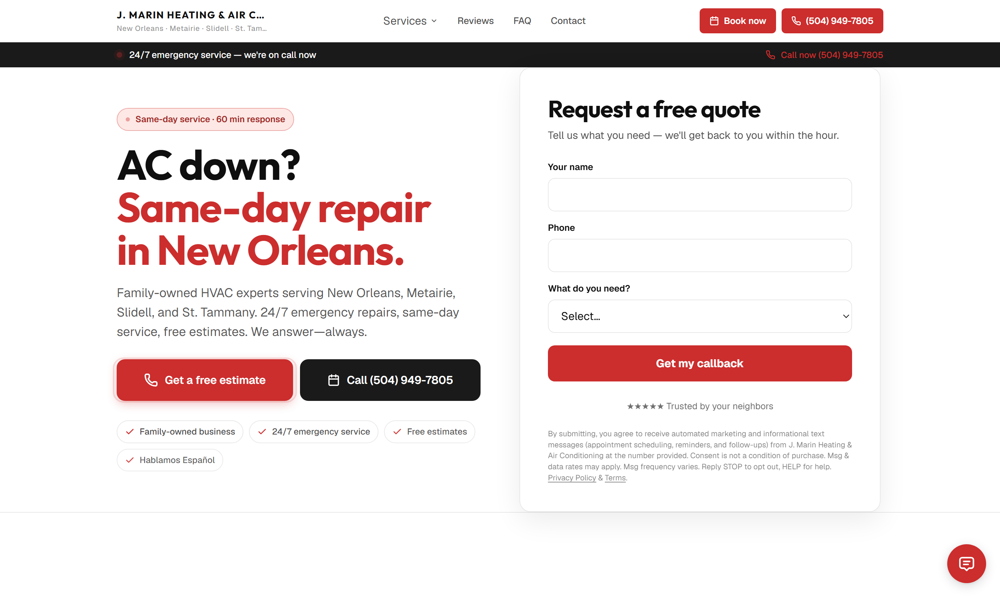
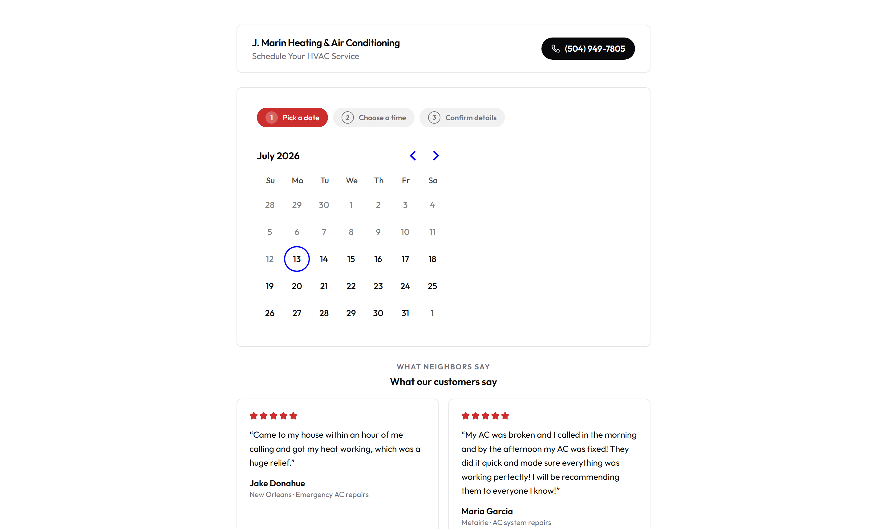
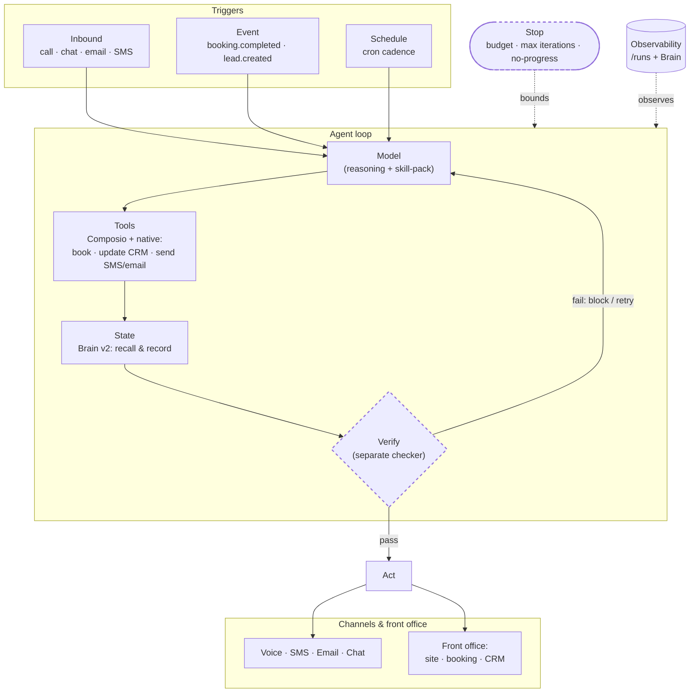

<div align="center">


# SeldonFrame

**Build almost any AI agent — from your IDE.**

The open-source platform that gives your coding agent the primitives real production agents need: triggers, skills, channels, tools, an owned memory (the Brain), guardrails, evals, one-command deploy, and built-in money rails. Describe an agent in one sentence — minutes later it's answering a real business's phone, chat, and SMS, and booking real appointments. Free to build.

[](LICENSE)
[](https://www.npmjs.com/package/@seldonframe/mcp)
[](https://github.com/seldonframe/seldonframe/stargazers)
[](https://discord.gg/sbVUu976NW)
[](https://x.com/seldonframe)
[](https://smithery.ai/servers/maximehoule100/seldonframe)

[Website](https://seldonframe.com) · [For builders](https://seldonframe.com/build) · [Docs](https://seldonframe.com/docs) · [Live demo](https://j-marin-heating-air-conditioning-9599.app.seldonframe.com/) · [Discord](https://discord.gg/sbVUu976NW)

</div>

---

## Ship your first agent in 60 seconds

```bash
claude mcp add seldonframe -- npx -y @seldonframe/mcp
```

```
> Build me an AI receptionist for an HVAC company in New Orleans.

  ✓ Live at acme-hvac.app.seldonframe.com
```

No API key. No signup form. **Your first workspace is free forever.** That one sentence stands up a hosted front office — website, booking page, intake form, CRM — with an AI agent already answering on chat and booking against the real calendar. Add a phone number and it answers calls too.

**See a real one — a live workspace, not a mockup:**

<table>
  <tr>
    <td width="50%">
      <a href="https://j-marin-heating-air-conditioning-9599.app.seldonframe.com/"></a>
    </td>
    <td width="50%">
      <a href="https://j-marin-heating-air-conditioning-9599.app.seldonframe.com/book"></a>
    </td>
  </tr>
  <tr>
    <td align="center"><sub>The generated site — quote intake, reviews, and the chat agent (bottom right)</sub></td>
    <td align="center"><sub>Its booking page — the real calendar the agent books against</sub></td>
  </tr>
</table>

Click either screenshot — [this HVAC workspace](https://j-marin-heating-air-conditioning-9599.app.seldonframe.com/) is live, and the chatbot on it books real appointments. Eight more live demo workspaces are on [seldonframe.com](https://seldonframe.com).

---

## What an agent is made of here

Most "agent frameworks" hand you a chat loop and wish you luck. SeldonFrame gives your IDE agent the full production anatomy:

### The agent model — Trigger × Skill × Channel

An agent isn't a chatbot UI; it's three independent axes:

- **Trigger** — *when it runs*: **inbound** (a call / chat / email / SMS arrives) · **event** (a domain event fires — `booking.completed`, `lead.created`, `invoice.paid`…) · **schedule** (a cron cadence).
- **Skill** — *what it does*: receptionist · review-requester · speed-to-lead · win-back · digest…
- **Channel** — *how it speaks*: voice · web chat · SMS · email · internal digest.
- **Tools** — *what it can touch*: native tools (book against the real calendar · read/write the CRM · send SMS & email · take a message) **plus 1,000+ app integrations via Composio** (Google Calendar, Sheets, Slack, HubSpot, Notion, …), bound per-agent.

`surface: voice | chat` (the old receptionist-only knob) is just one point in this space — `trigger=inbound`. One builder creates any agent; the marketplace sells any agent.

### From agent to production *loop*

A production agent is a **loop**, not a single prompt:

> **Trigger → (Model + Tools + State) → Verify → Iterate**, bounded by a **Stop** condition, improved by **Evals**, kept honest by **Observability + Guardrails**.

Two non-negotiables drive the roadmap: **the checker must be separate from the maker** (a model grading its own work is too generous a grader), and **the loop must have brakes** (or it bills you in silence). Where each primitive stands today:

| Primitive | Status | What's there |
|---|---|---|
| **Trigger** | ✅ Shipped | Inbound + **event** triggers on the `SeldonEvent` bus. `booking.completed` → review-requester; `lead.created` → speed-to-lead, both sending outbound SMS/email. |
| **State** | ✅ Shipped | Agent **loop-memory** in **Brain v2** — agents recall what they did before acting and record after. The review "ask once per customer" throttle is now a memory recall, not a bespoke flag. |
| **Verify** (maker ≠ checker) | ✅ Shipped | Deterministic validators grade every run — pass rates surface on each agent's health card and `/runs`; `run_agent_evals` replays scripted scenarios. Rolling out: the same checker as a hard pre-send gate + an LLM judge for judgment calls. |
| **Guardrails / Stop** | ✅ Shipped | Quote-guard (never invent prices), enforced read-back before booking, per-contact throttles, booking-policy enforcement (hours · duration · required fields), hard call/iteration caps. Rolling out: generic token-budget brakes for long-looping agents. |
| **Generate-by-default** | 🗺 Roadmap | One English sentence → trigger + skill + channel + guardrail + checker + state + stop, generated together. *"text every customer for a Google review the day after their job — never twice, only if completed"* emits all of it. |
### The loop, drawn



> Dashed nodes (**Verify**, **Stop**) are the in-progress primitives. **Trigger** and **State** are shipped today; the rest of the loop is landing next.

---
Deeper — the pre-wired stack, the architectural bet, the roadmap: **[docs/ARCHITECTURE.md](docs/ARCHITECTURE.md)**.

## Five agents you can ship today

Trigger × Skill × Channel are independent axes — pick one of each and you've architected an agent:

| Agent | Trigger | Skill | Channel | The interesting part |
|---|---|---|---|---|
| **AI receptionist** | inbound call | qualify + book | voice | Books against the real calendar. Quote-guard, enforced read-back, `take_message` escalation to the owner. |
| **Website chatbot** | inbound chat | the same receptionist skill | web embed | Same blueprint, different channel — channels are swappable. |
| **Speed-to-lead** | `lead.created` event | first-touch + qualify | SMS | Fires seconds after a form submit, straight off the event bus. |
| **Review requester** | `booking.completed` event | review ask | SMS / email | Brain recall enforces "never ask the same customer twice." |
| **Anything you describe** | any | one English sentence | any | The Studio wizard adapts its questions to the primitives your agent needs. |

## The Brain — memory that compounds

Agents that forget are demos. Every SeldonFrame workspace owns a **Brain**:

- **The Soul** — the single source of truth an agent grounds on (identity, services, hours, pricing). Install someone else's agent and it re-grounds on *your* Soul, never their facts.
- **Loop memory** — agents recall before acting and record after. "Did I already ask this customer for a review?" is a memory recall, not a bespoke flag.
- **Notes → distilled rules** — raw observations get compiled and promoted into durable knowledge on a schedule, so every run starts smarter than the last one ended.

## Money rails, built in

Agents that do real work end up touching real money — so the rails are platform primitives, not an integration project:

- **A prepaid wallet ledger** — UNIQUE idempotency keys and guarded never-negative decrements: a charge can't double-fire, a balance can't go below zero.
- **Stripe Connect payouts** — `seldonframe payout` moves accrued earnings to a bank account.
- **Checkout that fulfills** — a marketplace sale auto-provisions the deployment and re-grounds it on the buyer's business.
- **Per-use rental billing** — every agent exposes a signed MCP endpoint; other LLMs can rent it and the ledger meters each use.
- **Real phone numbers** — provision a number per agent (bring your own Twilio today; SF-managed metered numbers are rolling out).

<sub>Fee fine print: SeldonFrame takes a 5% GMV fee only when the marketplace brings the buyer, ~2% on sales through your own SeldonFrame storefront, and $0 anywhere else.</sub>

---

## Use SeldonFrame from any IDE

One npm package — [`@seldonframe/mcp`](https://www.npmjs.com/package/@seldonframe/mcp) — runs as a local MCP server in every major AI-native editor. Pick yours, paste the snippet, and ask your agent to build a workspace — your own website, booking page, intake form, and CRM, with the agent wired in. **First workspace is free and needs no API key.**

<details>
<summary><strong>Claude Code</strong></summary>

```bash
claude mcp add seldonframe -- npx -y @seldonframe/mcp
```

</details>

<details>
<summary><strong>Cursor</strong></summary>

Add to `~/.cursor/mcp.json`:

```json
{
  "mcpServers": {
    "seldonframe": {
      "command": "npx",
      "args": ["-y", "@seldonframe/mcp"]
    }
  }
}
```

</details>

<details>
<summary><strong>Windsurf</strong></summary>

Add to `~/.codeium/windsurf/mcp_config.json`:

```json
{
  "mcpServers": {
    "seldonframe": {
      "command": "npx",
      "args": ["-y", "@seldonframe/mcp"]
    }
  }
}
```

</details>

<details>
<summary><strong>VS Code (Copilot agent mode)</strong></summary>

Add to `.vscode/mcp.json`:

```json
{
  "servers": {
    "seldonframe": {
      "command": "npx",
      "args": ["-y", "@seldonframe/mcp"]
    }
  }
}
```

</details>

<details>
<summary><strong>Zed</strong></summary>

Add to `settings.json`:

```json
{
  "context_servers": {
    "seldonframe": {
      "source": "custom",
      "command": "npx",
      "args": ["-y", "@seldonframe/mcp"]
    }
  }
}
```

</details>

<details>
<summary><strong>Codex CLI</strong></summary>

Add to `~/.codex/config.toml`:

```toml
[mcp_servers.seldonframe]
command = "npx"
args = ["-y", "@seldonframe/mcp"]
```

Or one line: `codex mcp add seldonframe -- npx -y @seldonframe/mcp`

</details>

Once connected, restart your IDE (MCP connectors load at session start), then just say:

```
> Build a workspace for [business name]. [city, state]. [services]. [phone, optional].
```

See the same six snippets, kept in sync, at [seldonframe.com/build](https://seldonframe.com/build#install).

---

---

## When you're ready to sell

Your builder hub is **[seldonframe.com/build](https://seldonframe.com/build)** — publish an agent, set the price (monthly, per-call, per-outcome, or one-time), and any LLM can rent it over MCP. **Every published agent gets a free storefront**: a public listing page with schema.org markup, a markdown twin, and `llms.txt` coverage — so both humans *and* AI agents can discover and buy it. We ship the commodity agents as everyone's free floor, we never build vertical agents that compete with yours, and we never train on your prompts or data.

## Pricing — no surprises

| | |
|---|---|
| **Self-host** | $0 — AGPL-3.0, the entire monorepo |
| **Hosted — first workspace** | Free forever, no card |
| **Hosted — unlimited workspaces** | $29/mo flat (white-label + voice included) |
| **Your AI tokens** | Bring your own key — we never mark up usage |
| **When you sell** | 5% only when the marketplace brings the buyer · ~2% through your own storefront · **$0 anywhere else** |
## Tech stack

- **Next.js 16** (App Router) + **React 19** + **TypeScript** — one deployable app: dashboard, generated public sites, and API
- **Drizzle ORM** on **Postgres** (Neon in production; any Postgres 15+ when self-hosting)
- **Tailwind CSS 4**
- **pnpm workspaces + Turborepo** (monorepo)
- **MCP server** — [`@seldonframe/mcp`](https://www.npmjs.com/package/@seldonframe/mcp), plain Node, runs locally inside your IDE
- **Anthropic / OpenAI** (bring your own key) · **Stripe** payments · **Twilio** voice/SMS · **Resend** email

## Contributing

The highest-leverage PR here is **an agent template or a vertical skill-pack** — merged templates ship to the marketplace where every SeldonFrame user can find them, and you can list your own paid variants alongside. Core, connector, and eval PRs are equally welcome.

- Start with [CONTRIBUTING.md](CONTRIBUTING.md), then issues labeled `good first issue` / `help wanted`
- House rule: agent-behavior changes ship with eval scenarios; runtime changes ship with tests

## Community

- 💬 [Discord](https://discord.gg/sbVUu976NW) — fastest way to get help, feedback, or just say hi
- 🐦 [@seldonframe on X](https://x.com/seldonframe) — release notes, tips, dogfood notes
- 📚 [Docs](https://seldonframe.com/docs) — deeper guides than this README
- 🐛 [Issues](https://github.com/seldonframe/seldonframe/issues) · 📡 [Discussions](https://github.com/seldonframe/seldonframe/discussions)
- ✉️ Partnerships: [hello@seldonframe.com](mailto:hello@seldonframe.com)

## License

[AGPL-3.0](LICENSE) for the whole monorepo. Self-host freely; if you modify it and run it as a network service, your modifications stay open. For closed-source embedding, the hosted plan is the commercial alternative — see [LICENSING.md](LICENSING.md). Same dual model as Mattermost, Plausible, and Postiz.

<div align="center">

**Build an agent. Sell it. Get paid. — from your IDE.**

If this is the platform you've been looking for, [⭐ star the repo](https://github.com/seldonframe/seldonframe/stargazers) — it helps more builders find it.

</div>
