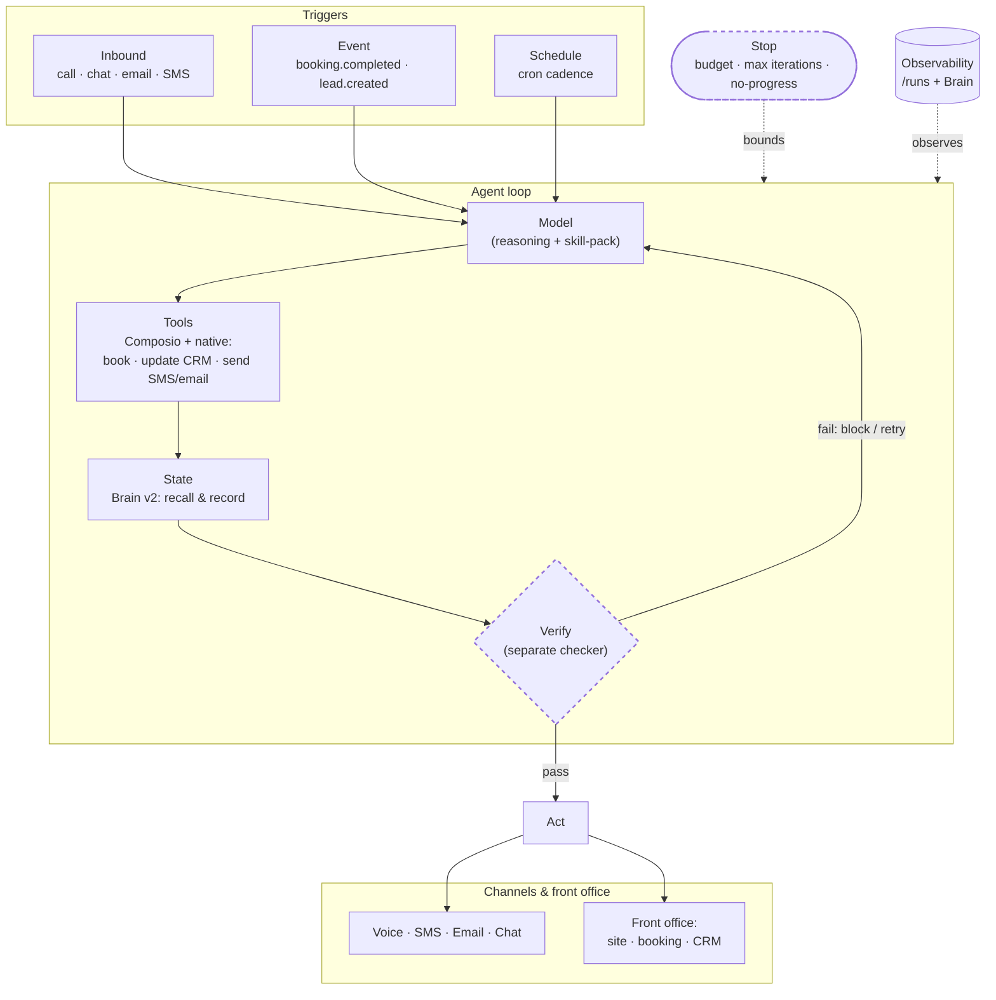

# SeldonFrame Architecture

> Moved from the README to keep the front page focused. This is the technical deep-dive: the agent model, the production loop, what's pre-wired, the stack, and the roadmap.

## How it works — the architecture

**SeldonFrame is a platform to build, run, and *sell* AI agents for service businesses.** Every agent ships with a real hosted front office — website, booking, intake, CRM, voice + chat — already wired on a live subdomain (`<slug>.app.seldonframe.com`). The bet underneath it: **thin harness + fat skills + an owned Brain** — keep the platform dumb and simple, put the intelligence in markdown skill-packs and an owned memory layer, and ride every model improvement for free. ([Why this bet ↓](#the-architectural-bet))

### The agent model — Trigger × Skill × Channel

An agent isn't a chatbot UI; it's three independent axes:

- **Trigger** — *when it runs*: **inbound** (a call / chat / email / SMS arrives) · **event** (a domain event fires — `booking.completed`, `lead.created`, `invoice.paid`…) · **schedule** (a cron cadence).
- **Skill** — *what it does*: receptionist · review-requester · speed-to-lead · win-back · digest…
- **Channel** — *how it speaks*: voice · web chat · SMS · email · internal digest.

`surface: voice | chat` (the old receptionist-only knob) is just one point in this space — `trigger=inbound`. One builder creates any agent; the marketplace sells any agent.

### From agent to production *loop*

A production agent is a **loop**, not a single prompt:

> **Trigger → (Model + Tools + State) → Verify → Iterate**, bounded by a **Stop** condition, improved by **Evals**, kept honest by **Observability + Guardrails**.

Two non-negotiables drive the roadmap: **the checker must be separate from the maker** (a model grading its own work is too generous a grader), and **the loop must have brakes** (or it bills you in silence). Where each primitive stands today:

| Primitive | Status | What's there |
|---|---|---|
| **Trigger** | ✅ Shipped | Inbound + **event** triggers on the `SeldonEvent` bus. `booking.completed` → review-requester; `lead.created` → speed-to-lead, both sending outbound SMS/email. |
| **State** | ✅ Shipped | Agent **loop-memory** in **Brain v2** — agents recall what they did before acting and record after. The review "ask once per customer" throttle is now a memory recall, not a bespoke flag. |
| **Verify** (maker ≠ checker) | 🚧 In progress | A separate strict checker gates output before send — deterministic rubric (link/name present, length-bounded) first, an optional eval/LLM checker for judgment. |
| **Guardrails / Stop** | 🚧 In progress | Per-agent guardrail layer (quote-guard, enforced read-back, throttle) + default brakes (max-iterations / token budget / no-progress) on looping or scheduled agents. |
| **Generate-by-default** | 🗺 Roadmap | One English sentence → trigger + skill + channel + guardrail + checker + state + stop, generated together. *"text every customer for a Google review the day after their job — never twice, only if completed"* emits all of it. |

### The pieces

- **Composio** — 1000+ tool connectors, so any agent can reach the client's own stack (calendar, CRM, payments) without bespoke integrations.
- **Brain v2** — the owned memory / Soul: the single source of truth an agent grounds on (business identity, services, pricing) and the durable per-agent, per-subject store it recalls from and records to.
- **`/runs` + RunContext + evals** — observability: every run is a persisted snapshot; `run_agent_evals` grades behavior (and becomes the in-loop Verify gate).
- **The marketplace** — build-once-sell-many: list an agent, **keep 95%**, and it's reachable **over MCP** so any LLM (Claude, ChatGPT, Cursor) can rent it.
- **Per-deployment customization** — one agent **template** → many client-customized **instances** (greeting, voice, business info, script/FAQ/services) without forking the agent.

### The loop, drawn



> Dashed nodes (**Verify**, **Stop**) are the in-progress primitives. **Trigger** and **State** are shipped today; the rest of the loop is landing next.

---

## What's pre-wired (zero glue work)

Every generated workspace ships with all surfaces connected to one workspace database:

- **AI receptionist** — answers the phone, qualifies the caller, and books straight into the calendar. Optional white-label add-on for agencies (per voice agent).
- **Missed-call text-back** — when a call comes in that nobody picks up, the caller gets a friendly text within seconds. The lead never goes cold. Wired by default to the workspace's branded sender.
- **AI chatbot** — embeds on any site, eval-gated, books appointments against the real calendar, refuses to invent prices outside the operator's configured rates. Runs on **your own AI key** (BYOK): your first workspace builds on us during the trial, then you connect your ChatGPT/Claude/Gemini key — no usage markup, you pay the provider at cost.
- **CRM** — contacts, deals, custom fields per vertical, kanban pipeline, customer portal
- **Booking page** — source-of-truth scheduling. The customer books on the branded SeldonFrame page; the appointment lands in the CRM AND syncs to Google Calendar in real time. SeldonFrame is the authority; Google Calendar is a downstream view.
- **Intake forms** — multi-step, vertical-specific fields, auto-CRM routing
- **Edit by chatting** — change copy, prices, sections, hours — describe it in natural language and the wired graph updates. No code, no admin wizard.
- **Agent archetypes** — 7 production archetypes ship out of the box: `speed-to-lead`, `win-back`, `review-requester`, `daily-digest`, `weather-aware-booking`, `appointment-confirm-sms`, `missed-call-text-back`. Event-triggered automations on the SeldonEvent bus — configure once per workspace; the archetype fires on every matching event (e.g., a missed call texts the caller back within 30 seconds, with the agency's branded sender)
- **Partner-agency white-label** — register an agency once, attach client workspaces, and the brand chrome (logo, colors, support email, verified sender domain, optional custom domain, hide-powered-by-badge on the Agency plan) substitutes everywhere the agency operator sees the product. Driven by 5 MCP tools (`register_partner_agency`, `register_partner_agency_sender_domain`, `verify_partner_agency_sender_domain`, `attach_workspace_to_partner_agency`, `detach_workspace_from_partner_agency`)
- **Email + SMS** — Resend (email) + Twilio (SMS), templated, automation-ready
- **Durable workflows** — Vercel Workflows powering reminders, follow-ups, sequences
- **Eval gate** — chatbots run an 8-scenario suite before going live (≥87.5% to publish)
- **Brand theme** — single primary color cascades to all surfaces, instantly

No Zapier configuration. No webhook plumbing. No "and then connect tool A to tool B." The data graph is single-source by design.

---


## Architecture at a glance

```
┌──────────────────────────────────────────────────────────────────────┐
│  Agency / freelancer                                                 │
│  Designs, sells, and maintains client ops stacks                     │
└──────────────────────────────────────────────────────────────────────┘
                                  ↕  natural language
┌──────────────────────────────────────────────────────────────────────┐
│  IDE-resident agent                                                  │
│  Claude Code · Cursor · Windsurf · Devin · custom MCP clients        │
└──────────────────────────────────────────────────────────────────────┘
                                  ↕  Model Context Protocol
┌──────────────────────────────────────────────────────────────────────┐
│  SeldonFrame MCP server  ────────────────────────────  thin harness  │
│  Typed tool surface · workspace state · capability map               │
└──────────────────────────────────────────────────────────────────────┘
                                  ↕
┌──────────────────────────────────────────────────────────────────────┐
│  Skill-pack registry  ────────────────────────────────  fat skill    │
│  Markdown · per-archetype · runtime-composed into the system prompt  │
└──────────────────────────────────────────────────────────────────────┘
                                  ↕
┌──────────────────────────────────────────────────────────────────────┐
│  Runtime                                                             │
│  Next.js 16 · Postgres (Drizzle) · Vercel Workflows · AGPL-3.0       │
│  Eval gate (8-scenario suite, ≥87.5% to publish, regen on critical)  │
└──────────────────────────────────────────────────────────────────────┘
                                  ↕
┌──────────────────────────────────────────────────────────────────────┐
│  Your own AI key (BYOK) — trial workspace builds on us               │
│  Anthropic · OpenAI · Stripe · Twilio · Resend · Google Calendar     │
└──────────────────────────────────────────────────────────────────────┘
```

You own every layer: SeldonFrame is AGPL-3.0; the customer data is yours; the deployed code is yours. On hosted, AI is managed for you (no key to bring); when you self-host, the database and the LLM key are yours too.

---

## The architectural bet

SeldonFrame is built on one decision: **the LLM is the application layer, the platform is plumbing.**

Most AI tools wrap a chatbot UI around an LLM, then hardcode the "intelligence" into TypeScript heuristics that get worse every time the model gets better. SeldonFrame inverts this:

- **Thin platform** — the harness is intentionally simple. A typed MCP tool surface, a block manifest, durable workflows, an eval runtime. None of it tries to be smart.
- **Fat skill** — every behavioral decision lives in markdown skill-packs the prompt composer reads at runtime. Edit a skill, ship intelligence. No code change.
- **Antifragile** — when Claude / GPT / Gemini get better, every SeldonFrame workspace gets better. We don't rewrite the platform; we let the model do more of the work.

The result for agencies: a client's chatbot in 2027 will be measurably better than its 2026 version, on the same SeldonFrame code, because the model improved. Your existing clients benefit without you re-shipping anything.

---


## What's interesting to contribute to

If you want to read or hack on the codebase, these are the parts where the architectural bets are most visible:

| Area | Path | What's interesting |
|------|------|--------------------|
| **MCP tool registry** | `skills/mcp-server/src/tools.js` | The typed tool surface and `USE-WHEN` triggers. Adding a new capability = one entry. |
| **Agent archetypes** | `packages/crm/src/lib/agents/archetypes/` | Event-triggered agent definitions, one TypeScript file each. Adding a new archetype = new file + one import in `index.ts`. The thin-harness side of the agent loop. |
| **Skill packs** | `packages/crm/src/lib/agents/skills/` | Agent intelligence as markdown. Edit prose, ship behavior. The fat-skill layer. |
| **Eval gate** | `packages/crm/src/lib/agents/eval-runner.ts` + `fallbacks.ts` | LLM regeneration on critical-fail. The runtime that catches its own hallucinations. |
| **Block library** | `packages/crm/src/components/landing/sections/` | The user-facing page primitives. New verticals = new blocks here. |
| **Motion primitives** | `packages/crm/src/components/motion/primitives.tsx` | Thin wrappers over `motion/react`. Composable, theme-aware, antifragile. |
| **Workflows** | `packages/crm/src/lib/workflows/` | Vercel Workflows (`"use workflow"`) for durable, sleep-without-burning-compute flows. |

**Not interesting**: the routing scaffolding, the auth boilerplate, the env-var wiring. Standard Next.js. Skip those if you're contributing intelligence, not infrastructure.

---

## Tech stack

- **Frontend**: Next.js 16 (Turbopack) · React 19 · Tailwind v4 · [motion](https://github.com/motiondivision/motion) · shadcn/ui
- **Backend**: Next.js API routes · Postgres (Neon) · Drizzle ORM · Vercel Workflows
- **AI**: Anthropic SDK · OpenAI SDK · Vercel AI SDK · MCP (TypeScript SDK)
- **Integrations**: Stripe · Twilio · Resend · Google Calendar (more via MCP servers)
- **Deploy**: Vercel · Docker · self-host

The full stack is described in our [stack](https://seldonframe.com/docs) docs. Open-source dependencies; no proprietary infrastructure required.

---


## Roadmap

The bets we're making, in rough order. Each is contributor-friendly — drop into Discord or open a GitHub Discussion to claim a piece.

### Soon

- **Voice + SMS transports** — same chatbot, three channels. The chatbot you build today answers the phone tomorrow. Twilio + Vapi/Retell on the voice side; Twilio + WhatsApp Business on messaging. Eval-gated per channel (different scenarios for "phone interruptions" vs "late-night SMS").
- **Self-improving agents** — runtime telemetry feeds back into skill-pack proposals. After 100 conversations, an agent can say *"I noticed customers ask about X 30 times — here's a draft skill addition. Approve or reject?"* Operator stays in the loop; agent does the work.
- **Renderer-level motion preset gating** — `minimal` short-circuits motion entirely; `editorial` adds Counter, MagneticButton, TextReveal.

### Mid-term — where the architecture starts to compound

- **Multi-agent orchestration** — agents that hire other agents. The booking agent calls a fraud-detection agent for high-value bookings. The intake-form agent calls a pricing-quote agent that calls a calendar-availability agent. Each agent has its own eval gate and its own MCP tool surface. Composing them is one prompt.
- **Skill-pack marketplace with revenue share** — community contributors publish vertical-specific skill packs ("Ambulance dispatch flow," "Real estate showing scheduling," "Wedding-photography pre-shoot intake"). The marketplace handles discovery, eval verification, and payouts. Skill packs are markdown — barrier to entry is *writing*, not engineering.
- **Vertical templates marketplace** — pre-built workspaces for industries beyond the current archetypes. Community-curated, eval-verified. *"Start a yoga studio"* → instant Business OS with vertical-tuned chatbot, intake fields, pipeline stages.

### Long-term — the agent era

- **Federated agent network** — agents from different SeldonFrame workspaces can negotiate. Your booking agent talks to a vendor's quote agent. A real-estate agent talks to a mortgage-lender agent. Agent-to-agent commerce as an emergent capability of the open MCP surface.
- **Long-running agency agents** — an agent that operates a client workspace for a week and reports back. *"I closed 12 deals, escalated 3, refunded 2, scheduled 47 appointments. Here's the trail."*
- **Agent fleet operations** — agencies running 100+ client workspaces from one console. Bulk skill-pack deployment, fleet-wide eval rollouts, comparative analytics across client agents.

Comment on what's missing or vote on priorities in [GitHub Discussions](https://github.com/seldonframe/seldonframe/discussions). The most interesting issues get labeled `architecture` and `help wanted`.

---

